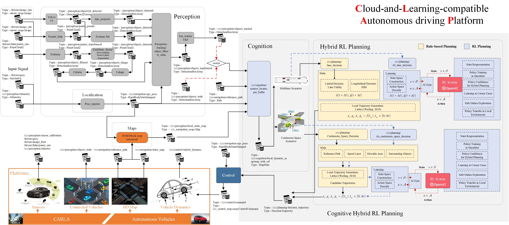

# ZZZ: Cloud Learning compatible Autonomous driving Platform (CLAP)

[](https://github.com/carla-simulator/carla)
[](https://www.ros.org/about-ros/)

[](docs/CLAP_Flow.jpg)

## Table of Contents

- [Background](#background)
- [Usage](#usage)
  - [Running with CARLA](#CARLA)
  - [Running on real vehicles](#AV)
- [Contributing](#contributing)
- [Citation](#citation)
- [Contact](#contact)

## Background

This code is a research oriented full stack autonomous driving platform. 
It has been implemented on the real autonomous vechiels as well as CARLA simluator.


## Usage

### Running with CARLA: compatible and easily access

> Please checkout the branch: dev/zhcao/master

The goals for this repository are:

1. Easily setup the environment: mainly using python
2. Easily transfer to real vehicle driving: Sharing the same code environment with the real vehicle implementment

### Running on real vehicles: efficient and stable

> Please checkout the branch: dev/xiaopengG3

The goals for this repository are:

1. Same codes with the real vehicle driving
2. Efficient: Codes are written in C++ for efficiency.

Example driving data can be downloaded from:

```bash
  https://pan.baidu.com/s/1846ZN8GzlhuyUD5FQEf_jw
  password：18xx
  Please reading the record.txt for detailed description.
```

## Contributing

Feel free to dive in!

Contributors main come from Tsinghua University and University of Michigan.

- Contributors:
Dr. Zhong Cao (Tsinghua), Yuanxin Zhong (Umich), Minghan Zhu (Umich), Weitao Zhou (Tsinghua)
- Advisors:
Pro. Diang Yang (Tsinghua), Prof. Huei Peng (Umich), Dr. Shaobing Xu (Umich)

## Citation

If you use this codes, please cite our IV2020 paper:

```
@inproceedings{zhong2020clap,
  title={CLAP: Cloud-and-Learning-compatible Autonomous driving Platform},
  author={Zhong, Yuanxin and Cao, Zhong and Zhu, Minghan and Wang, Xinpeng and Yang, Diange and Peng, Huei},
  booktitle={2020 IEEE Intelligent Vehicles Symposium (IV)},
  pages={1450--1456},
  organization={IEEE} 
}
```

## Contact

Please contact us if you have any questions. Zhong Cao (Tsinghua University): caozhong@tsinghua.edu.cn, Yuanxin Zhong (University of Michigan): zyxin@umich.edu
